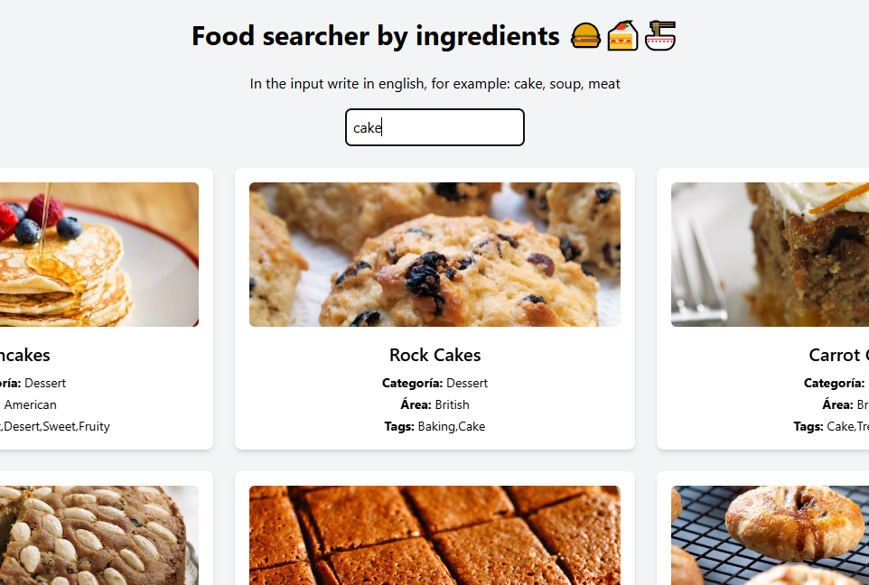

# 🍔 Food Searcher - Trabajo Práctico UTN

**Alumna:** María Tarima  
**Materia:** Proyecto Integrador - UTN  
**Repositorio:** [Ver en GitHub](https://github.com/manaomimasha/utn-api)  
**Demo Online:** [https://utn-api-manaomimashas-projects.vercel.app](https://utn-api-manaomimashas-projects.vercel.app)

---

## 📋 Descripción

Aplicación web desarrollada con **React + Vite + TailwindCSS** que permite buscar recetas de comida por ingredientes, utilizando la API pública de [TheMealDB](https://www.themealdb.com/).

Los resultados incluyen imagen, categoría, país de origen y etiquetas asociadas al plato.

---

## ✨ Tecnologías utilizadas

- ⚛️ React
- ⚡ Vite
- 🎨 TailwindCSS
- 🌐 Fetch API
- 🍽️ TheMealDB API

---

## 🧪 Funcionalidades

- 🔎 Búsqueda automática por ingrediente en inglés mientras el usuario escribe
- ❌ Si el input está vacío, los resultados se borran automáticamente
- 🧾 Renderizado de recetas con:
  - Imagen ilustrativa
  - Categoría del plato
  - Área geográfica de origen
  - Etiquetas (tags)
- 📱 Diseño responsive con tarjetas adaptables a dispositivos móviles


---

## 🖼️ Captura de pantalla



## 📁 Cómo clonar el proyecto

```bash
git clone https://github.com/manaomimasha/utn-api.git
cd utn-api
npm install
npm run dev